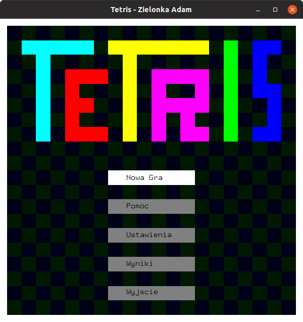
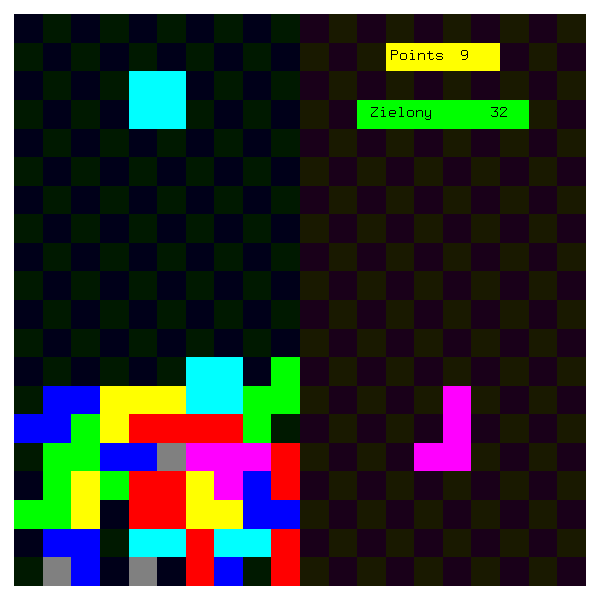
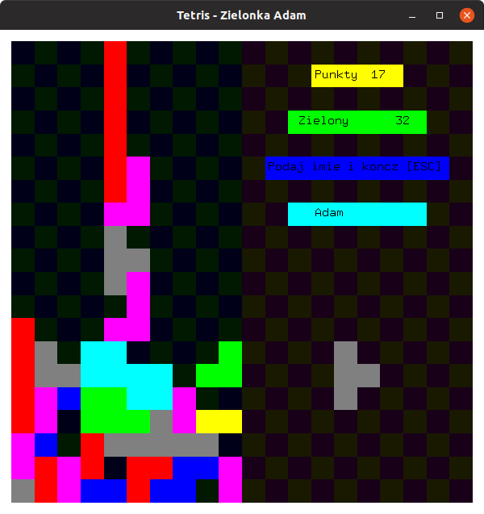
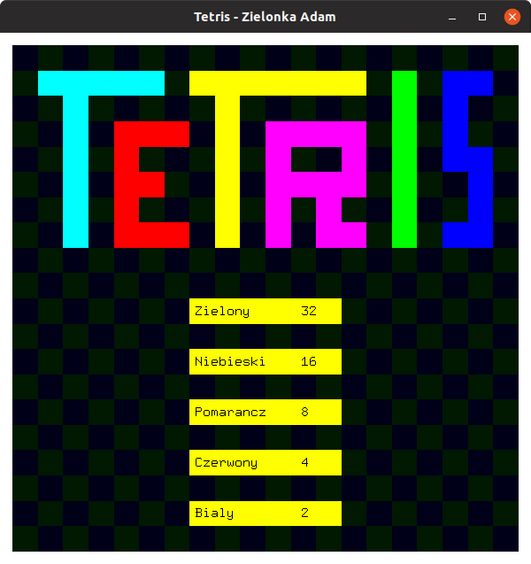
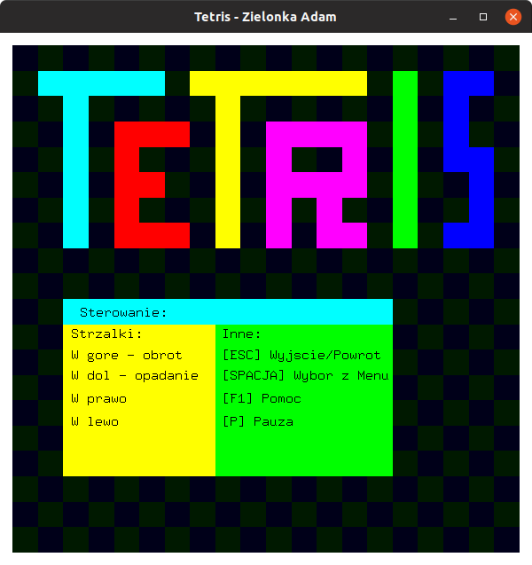
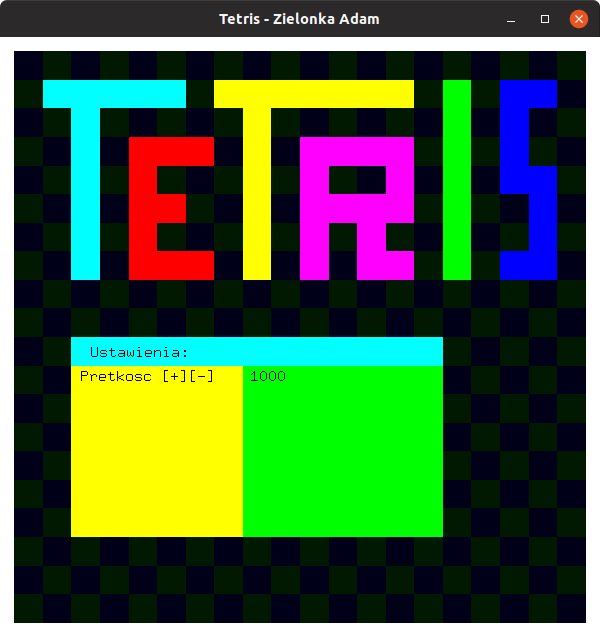

# Tetris

In June 2015, I was finishing my second year of my studies and I prepared this game to pass classes from ***Computer graphics and visualization*** (Polish: *Grafika komputerowa i wizualizacja*).

## Requirements

To build this game, you need: `g++` and `OpenGL` libraries (`gl.h`, `glu.h`, `glut.h`).

```
sudo add-apt-repository universe
```

```
sudo apt install g++ mesa-common-dev libglu1-mesa-dev freeglut3-dev -y
```

This command has been checked in Ubuntu 18.10.

## Build & Run

```
g++ -p -Wall -pedantic -o tetris.out tetris.cpp -lGL -lGLU -lglut -lm -std=c++0x 
```

```
./tetris.out
```

## Run on WSL

You can find more on this link: [Does WSL support openGL?](https://github.com/microsoft/WSL/issues/2855#issuecomment-358861903)

## Screens








## License
MIT
