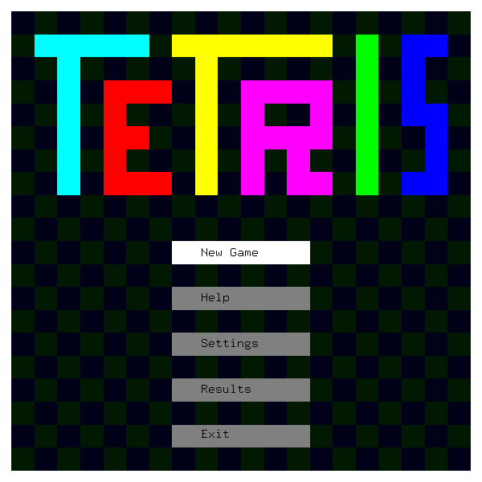
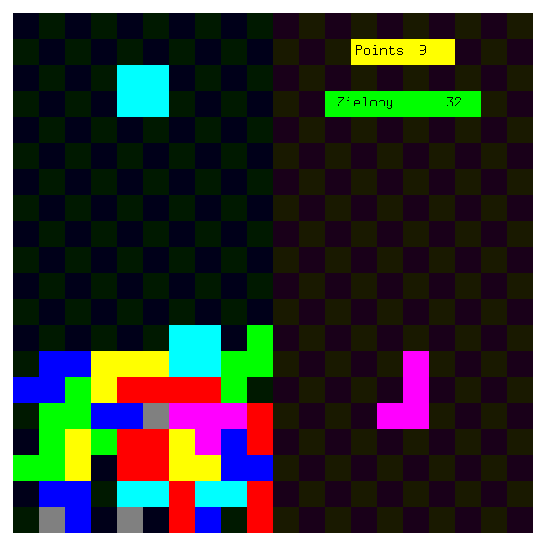
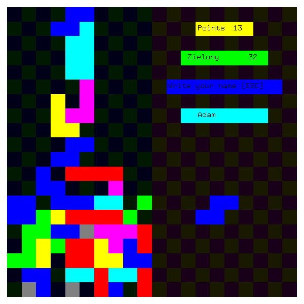
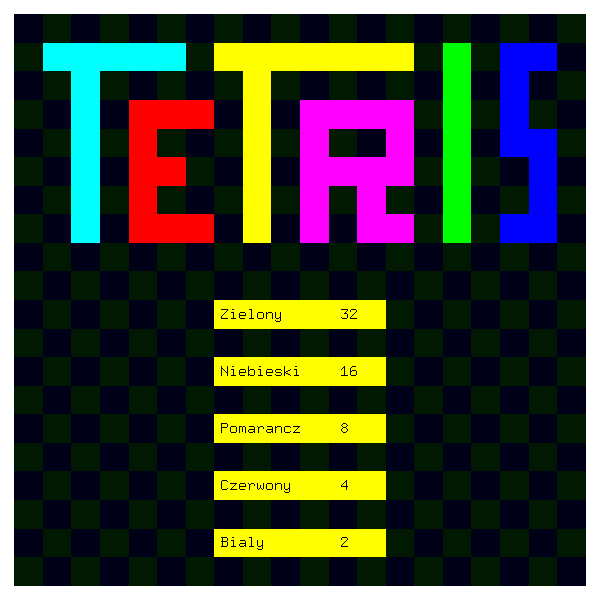
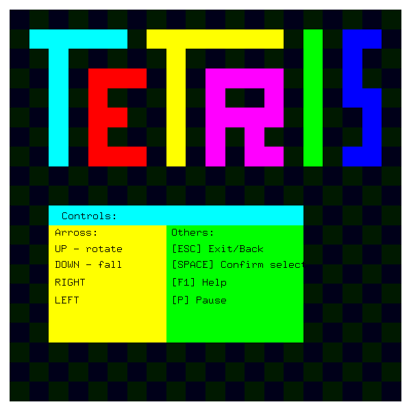
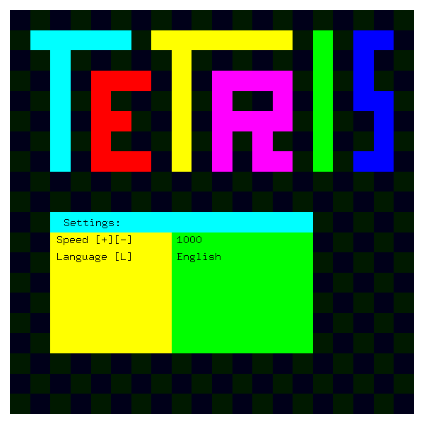

# Tetris

In June 2015, I was finishing my second year of my studies and I prepared this game to pass classes from ***Computer graphics and visualization*** (Polish: *Grafika komputerowa i wizualizacja*).

## Requirements

To build this game, you need: `g++` and `OpenGL` libraries (`gl.h`, `glu.h`, `glut.h`).

```shell
$ sudo add-apt-repository universe
$ sudo apt update && sudo apt install g++ mesa-common-dev libglu1-mesa-dev freeglut3-dev -y
```

This command has been checked in Ubuntu 18.10.

## Build & Run

```shell
$ g++ -o tetris.out tetris.cpp -lGL -lGLU -lglut -lm
$ ./tetris.out
```

## Run on WSL

On Windows:
- Install & Run [VcXsrv](https://sourceforge.net/projects/vcxsrv/)
- Choose: Multiple windows
- Display number: 0
- Start no client
- Disable: Native OpenGL
- (WSL2) Enable: Disable access control

After this, on WSL1:

```shell
$ export DISPLAY=localhost:0
$ ./tetris.out
```

on WSL2
```shell
$ export DISPLAY=$(grep -m 1 nameserver /etc/resolv.conf | awk '{print $2}'):0.0
$ ./tetris.out
```

You can find more on this link: [Does WSL support openGL?](https://github.com/microsoft/WSL/issues/2855#issuecomment-358861903) and [Can't use X-Server in WSL 2
](https://github.com/microsoft/WSL/issues/4106)

## Screens








## License
MIT
